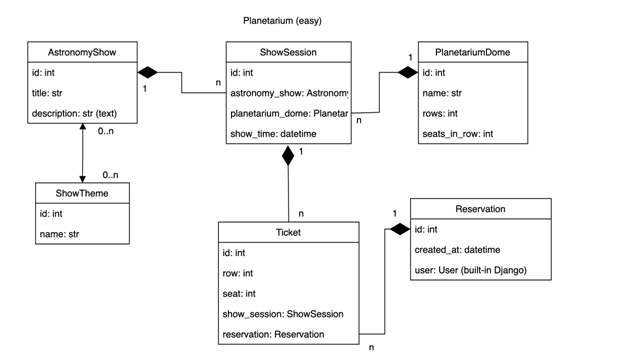
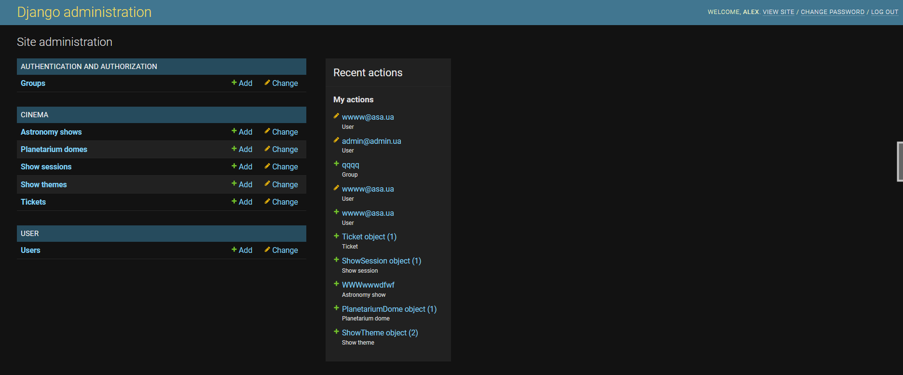

# Planetarium

- Read [the guideline](https://github.com/mate-academy/py-task-guideline/blob/main/README.md) before start
- Useful [link](https://soshace.com/dockerizing-django-with-postgres-redis-and-celery/) about theory 
  (without Celery & redis of course)
## Installing using GitHub
install PostgresSQL and create db

## DB structure:

## Pages images:

https://github.com/melnikalex1977/Planetarium5/pull/2
